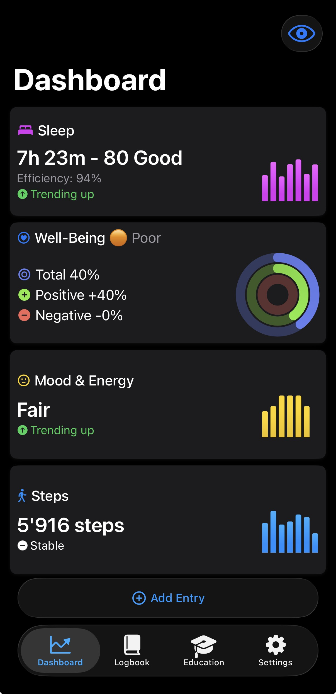
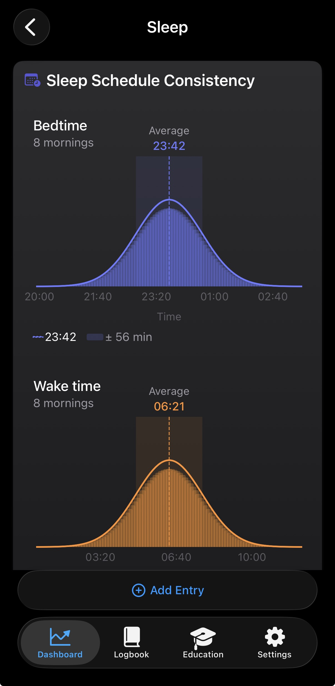
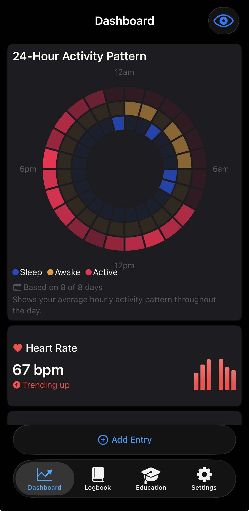
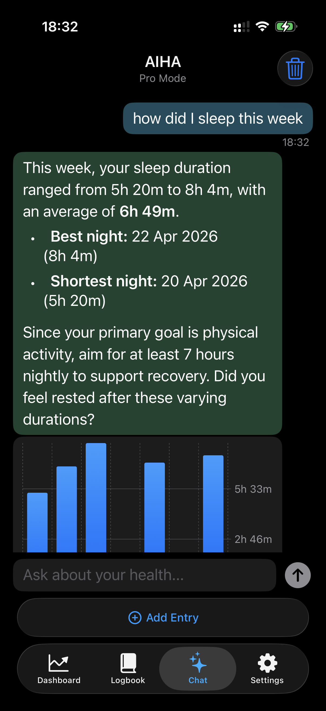
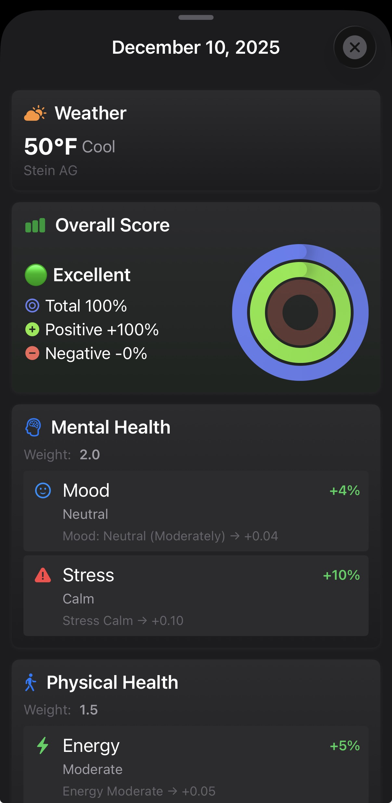
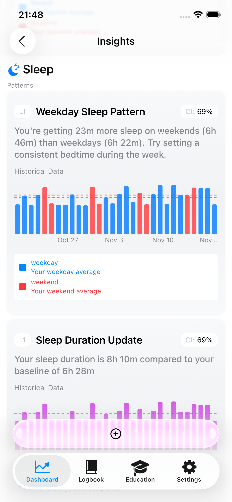

# Ahimo

**Understand what actually affects your health.** A privacy-first iOS health app that pairs your Apple Watch data with the context only you can provide — mood, stress, energy, drinks, symptoms — and uses on-device AI to surface the patterns that matter.

🌐 [ahimo.app](https://ahimo.app)

---

## What it is

Ahimo turns your iPhone into a personal health analyst. Apple Watch and HealthKit capture the biometrics — sleep, heart rate, HRV, steps, workouts. You add the context — how you felt, what you drank, the symptom you noticed, the stress you carried. Ahimo connects the two and tells you, in plain language, what is actually moving the needle on your sleep, mood, and recovery.

Then it lets you ask follow-up questions in **AIHA**, an on-device chat assistant that knows your data and never sends a byte of it off your phone.

**Everything runs locally.** No cloud processing of health data, no third-party AI service, no analytics on what you log. The on-device LLM is real — Apple Intelligence or MLX, your choice — and it stays on your device.

## Who it's for

- **People with an Apple Watch** who already have years of biometric data and want to make sense of it
- **Anyone tracking mood, stress, energy, or symptoms** and wondering how their habits affect them
- **Women tracking menstrual cycles** who want phase-aware insights into sleep, mood, HRV, and energy
- **Health-conscious users who refuse to upload their data** to yet another cloud service

## What it does

- 🧠 **Connects the dots** — 30+ correlation analyzers find the patterns: drinks → sleep, HRV → mood, activity → stress, cycle phase → energy
- 💬 **AIHA chat** — ask "how did I sleep this week?" or "what helps my energy most?" in natural language, grounded in your own data
- 📊 **CSQI** — Composite Sleep Quality Index that weighs duration, consistency, and stages into a single score
- 📅 **24-hour circadian view** — visualize your sleep, awake, and active periods across the day
- ⌚ **Apple Watch companion** — quick logging, well-being score on your wrist, complications, offline queue
- 🧩 **Three home-screen widgets** — Well-Being score, Weather & Mood, latest AI Insight
- ☁️ **Optional iCloud backup** — opt-in, encrypted by Apple, never enabled by default
- 🌍 **EN / DE / ES**

## See it in action

| | | |
|---|---|---|
|  |  |  |
| **Dashboard** — biometrics + your context in one view | **Insights** — Layer 2/3 correlations explained in plain English | **Circadian** — your real 24-hour rhythm |
|  |  |  |
| **AIHA Pro Mode** — ask anything, answers grounded in your data | **Well-Being score** — a single weighted number you can act on | **Sleep detail** — CSQI, stages, trends |

## Why on-device matters

Your health data is the most personal data you own. Ahimo is built so that none of it has to leave your iPhone to be useful.

- The 30 correlation analyzers run locally.
- The LLM (Apple Foundation Models or MLX models like SmolLM3, Qwen, Llama) runs locally on the Neural Engine.
- The chat history lives locally.
- The only thing Ahimo ever sends off-device is anonymous crash logs (mandatory) and optional analytics you can disable.

If you choose to enable iCloud backup, your data goes to **your** iCloud — Apple is the controller, the keys can be yours under Advanced Data Protection, and Ahimo never sees it.

## Platforms

- **iPhone** (iOS) — primary app, dashboard, insights, AIHA chat, settings
- **Apple Watch** (watchOS) — quick logging, well-being view, complications, offline entry queue
- **Home-screen widgets** — Well-Being, Weather & Mood, AI Insight
- **iCloud** — optional backup via CloudKit
- **HealthKit** — read/write integration for sleep, heart rate, HRV, steps, workouts, menstrual data

## Links

- 🌐 Website: [ahimo.app](https://ahimo.app)
- 📖 [About Ahimo](./ABOUT.md)
- ✨ [Full feature list](./FEATURES.md)
- ❓ [FAQ](./FAQ.md)

---

*Ahimo is built by [Radim Simanek](https://github.com/Rad1m) and is a trademark of Ahimo Inc. Designed in Switzerland. This repository contains marketing and documentation content only — the app's source code is private. See [LICENSE](./LICENSE) for usage terms on the documentation content.*
